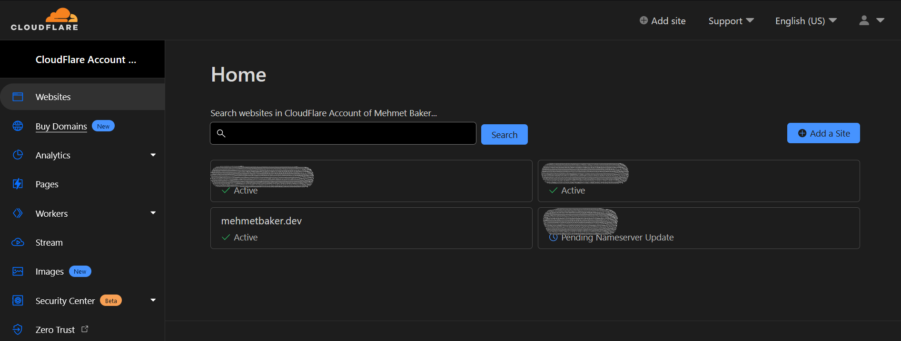
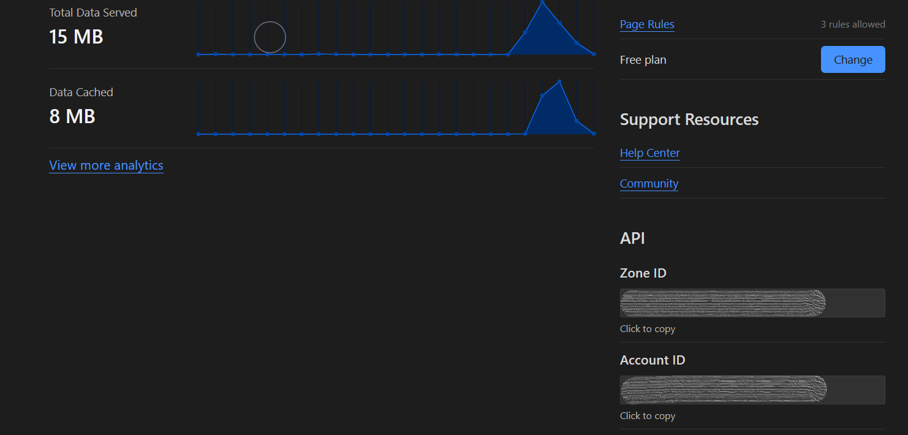
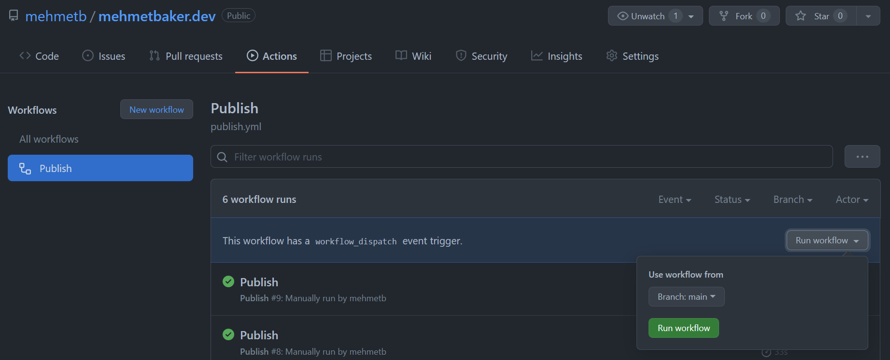

# mehmetbaker.dev

This website is running on [Cloudflare Workers](https://workers.cloudflare.com).
You can modify it and run your own website.

## Getting started

First, clone this repository.

```
git clone git@github.com:mehmetb/mehmetbaker.dev.git
```

Then, install [@cloudflare/wrangler](https://www.npmjs.com/package/@cloudflare/wrangler) CLI tool globally.

```
npm install --global @cloudflare/wrangler
```

Finally, install the project dependencies.

```
npm install
```
## Development

Run this command to start the server in development mode.

```
npm run dev
```

Then, navigate to [http://localhost:8787](http://localhost:8787) in your browser.

**Note: You need to comment out some security headers for livereload to work. Go to [securityHeaders.ts](./src/middleware/securityHeaders.ts#L67) and comment out the Content-Security-Policy line. I highly recommend enabling it for production.**

### Publishing

First, edit the [wranger.toml](./wrangler.toml) configuration.

Set a name for your production app and set the routes for your website:

```toml
[env.production]
name = "alphanumeric_name"
zone_id = "will be overridden by CF_ZONE_ID environment variable"
workers_dev = false
routes = [
  "*.example.com/*",
  "example.com/*"
]
```

[Create a Cloudflare API Token](https://developers.cloudflare.com/api/tokens/create/). After creating the API token, copy it to a notepad. Becasue if you refresh your CloudFlare dashboard you won't be able to see the API token again and will have to create a new token.

Navigate to your [GitHub repository secrets](https://docs.github.com/en/actions/security-guides/encrypted-secrets#creating-encrypted-secrets-for-a-repository) settings page. *Note: If you see both Dependabot and Actions in the Secrets dropdown, choose Actions secrets.*

Create a new repository secret. Secret name must be `CF_API_TOKEN`. Paste your Cloudflare API token in the Value box and press the Add secret button.

Go to your [Cloudflare Dashboard](https://dash.cloudflare.com).



Navigate to your website's overview.



Create a GitHub repository secret named `CF_ZONE_ID` and paste your Zone ID as its value.

Create a GitHub repository secret named `CF_ACCOUNT_ID` and paste your Account ID as its value.

Now, go to Actions tab of your repository and run the Publish workflow from the main branch your repository.



That's it, you're online! 
